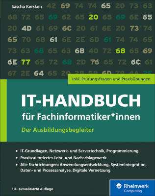

# IT-Handbuch für Fachinformatiker*innen
Alle Codebeispiele und Lösungen aus dem "IT-Handbuch für Fachinformatiker*innen"

Ab dem 30.06.2021 finden Sie hier alle Codebeispiele.

[Webseite zum IT-Handbuch beim Rheinwerk Verlag](https://www.rheinwerk-verlag.de/it-handbuch-fur-fachinformatikerinnen_5274/)

Informationen und Materialien (Listing, Lösungen) zur noch erhältlichen 9. Auflage (2019) finden Sie [hier](https://www.rheinwerk-verlag.de/it-handbuch-fuer-fachinformatiker-der-ausbildungsbegleiter/).
